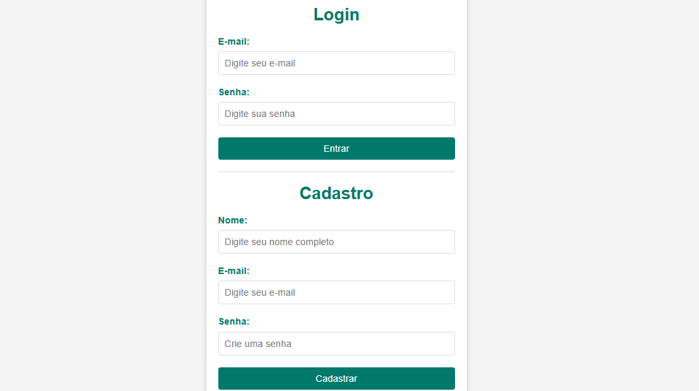
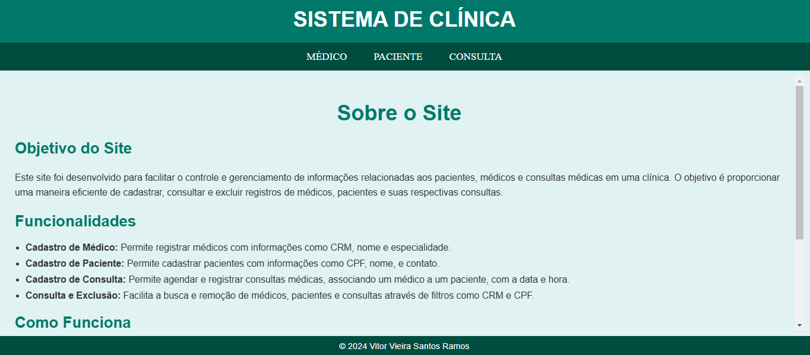
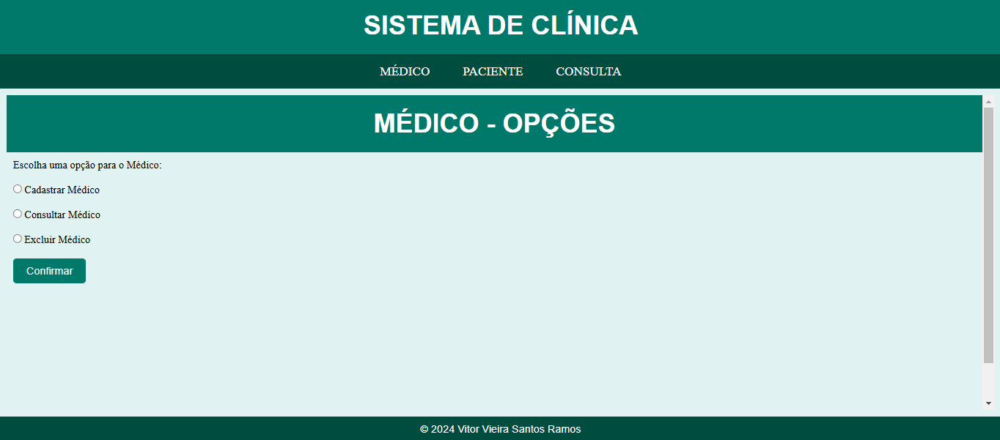
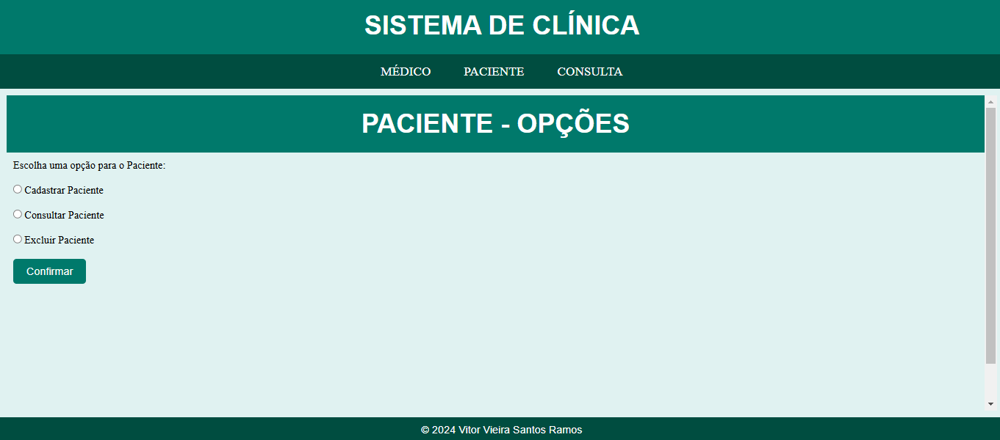
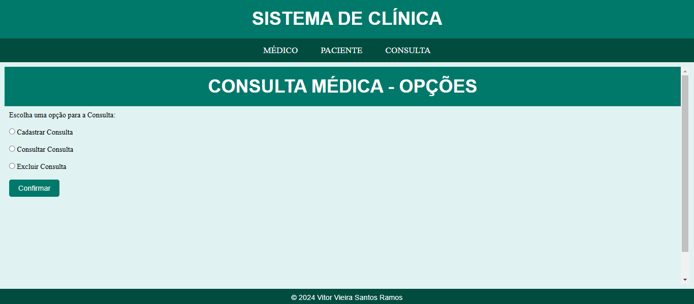

# 🏥 Sistema de Gerenciamento de Clínica Médica

[](https://javaee.github.io/javaee-spec/)
[](https://www.mysql.com/)
[](https://tomcat.apache.org/)
[](https://www.w3.org/)

> 🌎 **Este projeto também está disponível em [Inglês](/clinic-control/README.md).**

Este projeto foi desenvolvido como parte do **Projeto Integrador** no final do 2º semestre da graduação em **Análise e Desenvolvimento de Sistemas (ADS)**. O objetivo do projeto foi criar um sistema **web** para gerenciar informações de **médicos**, **pacientes** e **consultas médicas**, utilizando as tecnologias **JSP**, **MySQL**, **Tomcat** e **Web**.

### 🌟 Objetivo

Facilitar o gerenciamento de uma clínica médica com funcionalidades para registrar, consultar e excluir registros de médicos, pacientes e consultas de forma eficiente. O sistema mantém a integridade dos dados, interligando as informações através de chaves como CRM e CPF.

---

### 🔑 Funcionalidades

- **Cadastro de Médico**: Registra médicos com informações como **CRM**, **nome** e **especialidade**.
- **Cadastro de Paciente**: Registra pacientes com **CPF**, **nome** e **contato**.
- **Cadastro de Consulta**: Registra consultas médicas, associando um **médico** a um **paciente**, com **data** e **hora** específicas.
- **Consulta e Exclusão**: Permite a busca e remoção de médicos, pacientes e consultas usando filtros como **CRM** e **CPF**.

---

### 📊 Como Funciona

O sistema é dividido em três módulos principais que permitem a **interação entre médicos, pacientes e consultas** de forma fácil e intuitiva:

1. **Médico**: Cadastro, consulta e exclusão de médicos.
2. **Paciente**: Cadastro, consulta e exclusão de pacientes.
3. **Consulta**: Cadastro, consulta e exclusão de consultas médicas, vinculando médicos e pacientes.

A integridade dos dados é garantida através de chaves de relacionamento, como **CRM** para médicos e **CPF** para pacientes.

---

### 👨‍💻 Equipe de Desenvolvimento

**Desenvolvido por**: **Vitor Vieira Santos Ramos**

Este projeto foi desenvolvido com o objetivo de **aplicar e aprender** conceitos de **desenvolvimento web**, **integração com banco de dados** e **JSP**, além de proporcionar **experiência prática no desenvolvimento de sistemas para gestão de clínicas médicas**.

**Nota**: Recebido **9,5** pela falta da funcionalidade de **alteração** de registros.

---

### ⚙️ Como Rodar o Projeto

1. **Clone o repositório**:
    ```bash
    git clone https://github.com/vrzindev/clinic-control.git
    ```

2. **Configuração do Banco de Dados**:
    - Crie o banco de dados MySQL e as tabelas necessárias para o funcionamento do sistema.
    - Importante: Verifique se os **detalhes de conexão com o banco de dados** estão corretos no arquivo de configuração.

3. **Implemente o Projeto no Tomcat**:
    - Importe o projeto em sua IDE favorita (Eclipse, IntelliJ).
    - Configure o **servidor Tomcat** para rodar a aplicação.

4. **Acesse a Aplicação**:
    - Após a configuração, basta rodar o servidor Tomcat e acessar o sistema pelo navegador.

---

### 📸 Screenshots



 



---

### 🚀 Tecnologias Utilizadas

- **JSP (JavaServer Pages)**: Para criação da interface web dinâmica.
- **MySQL**: Banco de dados para armazenar as informações de médicos, pacientes e consultas.
- **Tomcat**: Servidor de aplicação utilizado para rodar o sistema.
- **HTML/CSS**: Para construção da interface de usuário e estilização.

---

### 📍 Próximos Passos

- **Implementar a funcionalidade de alteração de registros** (ainda não implementada no projeto).
- Melhorar a interface com **design responsivo**.

---

### 💬 Feedback

Fique à vontade para abrir **issues** ou **pull requests** para sugestões, melhorias ou correções.

---

### 📝 Licença

Este projeto está licenciado sob a **MIT License**. Veja o arquivo [LICENSE](LICENSE) para mais detalhes.

---

**Obrigado por visitar o repositório!**
