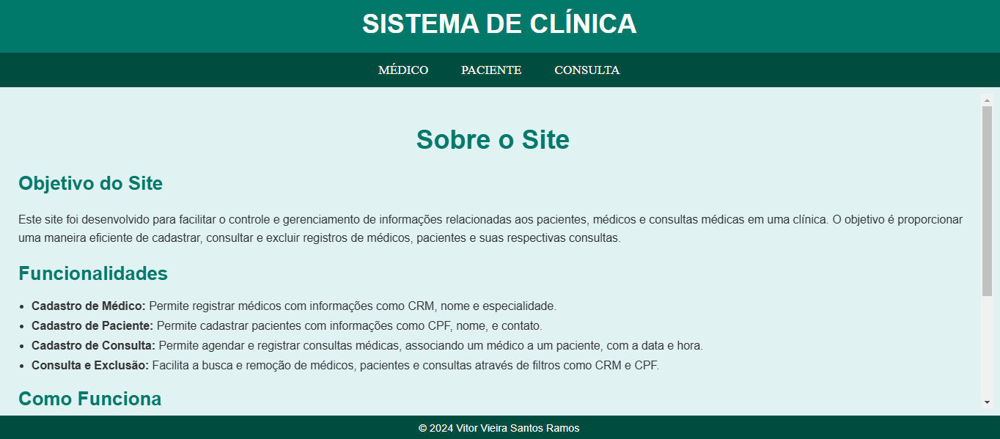
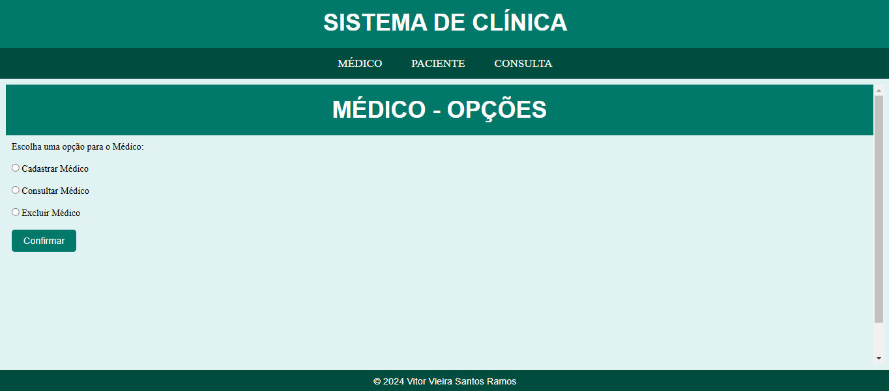
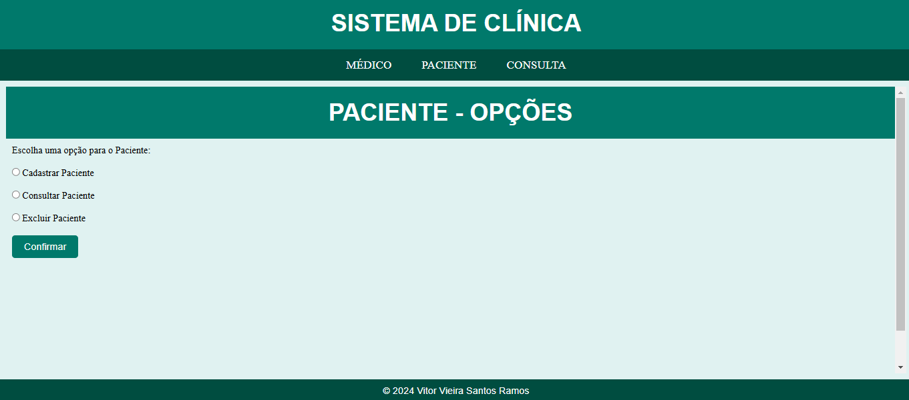
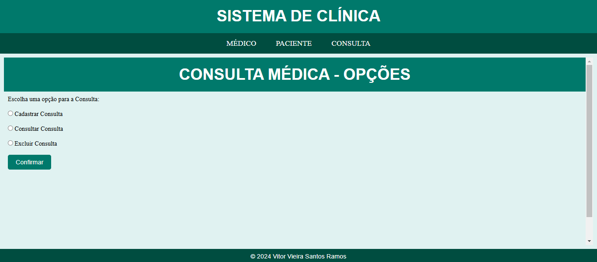

# 🏥 Clinic Management System

[](https://javaee.github.io/javaee-spec/)
[](https://www.mysql.com/)
[](https://tomcat.apache.org/)
[](https://www.w3.org/)

> 🌎 **This project is also available in [Portuguese](/clinic-control/README-pt.md).**


This project was developed as part of the **Integrative Project** at the end of the 2nd semester of the **Systems Analysis and Development (ADS)** undergraduate course. The goal of the project was to create a **web** system for managing information about **doctors**, **patients**, and **medical appointments**, using the technologies **JSP**, **MySQL**, **Tomcat**, and **Web**.

### 🌟 Objective

To facilitate the management of a medical clinic with features to register, query, and delete records of doctors, patients, and appointments efficiently. The system maintains data integrity by interlinking information using keys such as CRM and CPF.

---

### 🔑 Features

- **Doctor Registration**: Registers doctors with information like **CRM**, **name**, and **specialty**.
- **Patient Registration**: Registers patients with **CPF**, **name**, and **contact**.
- **Appointment Registration**: Registers medical appointments, linking a **doctor** to a **patient**, with specific **date** and **time**.
- **Query and Delete**: Allows searching and removal of doctors, patients, and appointments using filters like **CRM** and **CPF**.

---

### 📊 How It Works

The system is divided into three main modules that allow **interaction between doctors, patients, and appointments** in an easy and intuitive way:

1. **Doctor**: Register, query, and delete doctors.
2. **Patient**: Register, query, and delete patients.
3. **Appointment**: Register, query, and delete medical appointments, linking doctors and patients.

Data integrity is guaranteed through relationship keys such as **CRM** for doctors and **CPF** for patients.

---

### 👨‍💻 Development Team

**Developed by**: **Vitor Vieira Santos Ramos**

This project was developed with the goal of **applying and learning** web development concepts, **database integration**, and **JSP**, as well as providing **hands-on experience in developing systems for clinic management**.

**Note**: Received a **9.5** grade due to the absence of the **record modification** functionality.

---

### ⚙️ How to Run the Project

1. **Clone the repository**:
    ```bash
    git clone https://github.com/vrzindev/clinic-control.git
    ```

2. **Set up the Database**:
    - Create the MySQL database and necessary tables for the system to work.
    - Important: Verify if the **database connection details** are correct in the configuration file.

3. **Deploy the Project on Tomcat**:
    - Import the project into your preferred IDE (Eclipse, IntelliJ).
    - Set up the **Tomcat server** to run the application.

4. **Access the Application**:
    - Once configured, simply run the Tomcat server and access the system through your browser.

---

### 📸 Screenshots



 



---

### 🚀 Technologies Used

- **JSP (JavaServer Pages)**: For creating the dynamic web interface.
- **MySQL**: Database for storing doctors, patients, and appointments information.
- **Tomcat**: Application server used to run the system.
- **HTML/CSS**: For building the user interface and styling.

---

### 📍 Next Steps

- **Implement the functionality to modify records** (still not implemented in the project).
- Improve the interface with a **responsive design**.

---

### 💬 Feedback

Feel free to open **issues** or **pull requests** for suggestions, improvements, or fixes.

---

### 📝 License

This project is licensed under the **MIT License**. See the [LICENSE](LICENSE) file for more details.

---

**Thank you for visiting the repository!**
